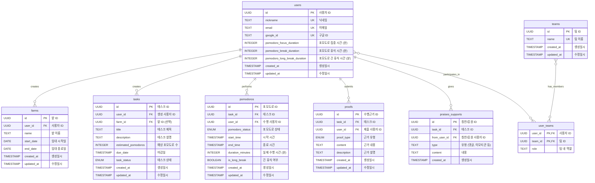

```mermaid
erDiagram
    users {
        UUID id PK "사용자 ID"
        TEXT nickname UK "닉네임"
        TEXT email UK "이메일"
        TEXT google_id UK "구글 ID"
        INTEGER pomodoro_focus_duration "포모도로 집중 시간 (분)"
        INTEGER pomodoro_break_duration "포모도로 휴식 시간 (분)"
        INTEGER pomodoro_long_break_duration "포모도로 긴 휴식 시간 (분)"
        TIMESTAMP created_at "생성일시"
        TIMESTAMP updated_at "수정일시"
    }

    farms {
        UUID id PK "밭 ID"
        UUID user_id FK "사용자 ID"
        TEXT name "밭 이름"
        DATE start_date "임대 시작일"
        DATE end_date "임대 종료일"
        TIMESTAMP created_at "생성일시"
        TIMESTAMP updated_at "수정일시"
    }

    teams {
        UUID id PK "팀 ID"
        TEXT name UK "팀 이름"
        TIMESTAMP created_at "생성일시"
        TIMESTAMP updated_at "수정일시"
    }

    user_teams {
        UUID user_id PK,FK "사용자 ID"
        UUID team_id PK,FK "팀 ID"
        TEXT role "팀 내 역할"
    }

    tasks {
        UUID id PK "태스크 ID"
        UUID user_id FK "생성 사용자 ID"
        UUID farm_id FK "밭 ID (선택)"
        TEXT title "태스크 제목"
        TEXT description "태스크 설명"
        INTEGER estimated_pomodoros "예상 포모도로 수"
        TIMESTAMP due_date "마감일"
        ENUM task_status "태스크 상태"
        TIMESTAMP created_at "생성일시"
        TIMESTAMP updated_at "수정일시"
    }

    pomodoros {
        UUID id PK "포모도로 ID"
        UUID task_id FK "태스크 ID"
        UUID user_id FK "수행 사용자 ID"
        ENUM pomodoro_status "포모도로 상태"
        TIMESTAMP start_time "시작 시간"
        TIMESTAMP end_time "종료 시간"
        INTEGER duration_minutes "실제 수행 시간 (분)"
        BOOLEAN is_long_break "긴 휴식 여부"
        TIMESTAMP created_at "생성일시"
        TIMESTAMP updated_at "수정일시"
    }

    proofs {
        UUID id PK "수행근거 ID"
        UUID task_id FK "태스크 ID"
        UUID user_id FK "제출 사용자 ID"
        ENUM proof_type "근거 유형"
        TEXT content "근거 내용"
        TEXT description "근거 설명"
        TIMESTAMP created_at "생성일시"
        TIMESTAMP updated_at "수정일시"
    }

    praises_supports {
        UUID id PK "칭찬/응원 ID"
        UUID task_id FK "태스크 ID"
        UUID from_user_id FK "칭찬/응원 사용자 ID"
        TEXT type "유형 (댓글, 이모티콘 등)"
        TEXT content "내용"
        TIMESTAMP created_at "생성일시"
    }

    users ||--o{ farms : "creates"
    users ||--o{ tasks : "creates"
    users ||--o{ pomodoros : "performs"
    users ||--o{ proofs : "submits"
    users ||--o{ praises_supports : "gives"
    users }o--o{ user_teams : "participates_in"
    teams }o--o{ user_teams : "has_members"
```
